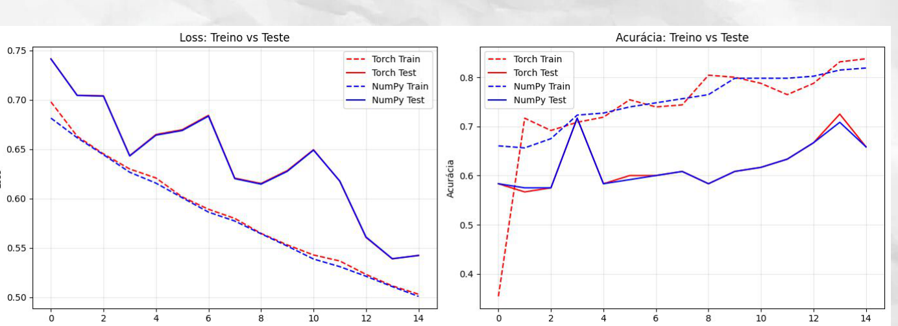

# Convolução 1D from scratch

Implementação de uma Rede Neural Convolucional unidimensional desenvolvida do zero com NumPy. O projeto foi realizado como trabalho da disciplina de Aprendizado Profundo da Universidade Federal Fluminense, com foco na dedução e implementação do *forward* e do *backpropagation*.

## Implementação

- Convolução 1D com *stride*, *padding* e dilatação
- Max Pooling
- Flatten
- Camada totalmente conectada
- ReLU e Sigmoid
- Binary Cross-Entropy
- Forward e backpropagation
- Composição sequencial de camadas

```text
Entrada → Conv1D → ReLU → MaxPooling → Flatten → Fully Connected → Sigmoid
```

## Validação

A implementação foi comparada com uma arquitetura equivalente em PyTorch na classificação de atividades humanas do conjunto WISDM. As curvas de *loss* e acurácia foram utilizadas para verificar o comportamento da implementação em NumPy.



## Uso

```bash
pip install -r requirements.txt
```

```python
from Conv_1D import ConvLayer
from FullyConnected import FullyConnected
from Sequential import Sequential
from activ_func import ReLU, Sigmoid
from flatten import Flatten
from max_pooling import MaxPooling

modelo = Sequential([
    ConvLayer(kernel_size=3, in_channels=3, out_channels=4),
    ReLU(),
    MaxPooling(size=2),
    Flatten(),
    FullyConnected(input_size=396, output_size=1),
    Sigmoid(),
])
```

## Material do trabalho

- [Relatório](docs/relatorio.pdf)
- [Slides](docs/slides.pdf)

## Autores

- Bernardo Mendes Rebello
- Lucas Pinto Avelar
